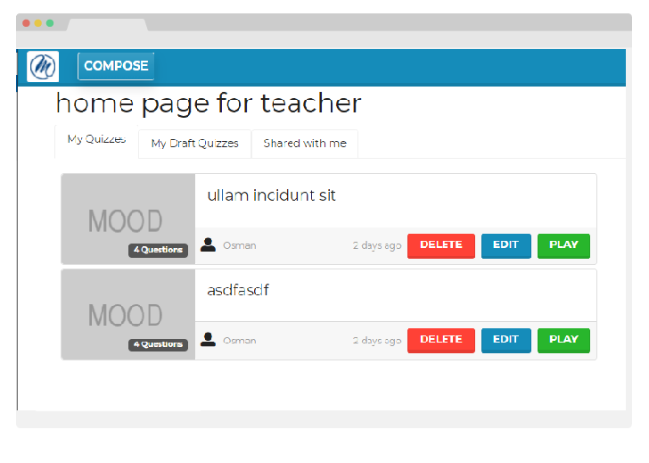

 

<h1 align="center">MOOD METU Online Oyun Desteği</h1>
<div align="center">
  <h3>
    <a href="https://btspmood.herokuapp.com/">
      Heroku
    </a>
     | 
    <a href="https://github.com/btsp24/mood">
      Github repository
    </a> 
    </h3></div>


## Table of Contents

- [Overview](#overview)
- [Built With](#built-with)
- [Features](#features)
- [How to use](#how-to-use)
- [Acknowledgements](#acknowledgements)
- [Contact](#contact)


## Overview



[Kahoot!](https://kahoot.com) is a game-based learning platform, used as educational technology in schools and other educational institutions. This project is as a  certification education project based on Kahoot ©. 

Some of the tools used in the project is listed below.

### Built With

- [HTML 5](https://en.wikipedia.org/wiki/HTML5) / [CSS](https://tr.wikipedia.org/wiki/CSS) / [Bootstrap 5](https://getbootstrap.com/docs/5.0/getting-started/introduction/)
- [PostgreSQL 12](https://www.postgresql.org/)
- [Sqlite](https://www.sqlite.org/) (for development environment)
- [Node.Js](https://nodejs.org/)
- [Express.js](https://expressjs.com/)
- [ejs](https://ejs.co/)
- [Socket.io](https://socket.io/)
- [Sequelize ORM](https://sequelize.org/)
- [Meteor Modeler](https://www.datensen.com/orm-design-tool/meteor-modeler-for-orm.html)
- [Multer](https://www.npmjs.com/package/multer)


## Features

This project was built for educational purposes during the [**ITCP - Information Technologies Certificate Program 24th Term**](./about_itcp.md) of [ODTÜ Sürekli Eğitim Merkezi (SEM)](https://sem.metu.edu.tr/). 

## How To Use

To clone and run this application, you'll need [Git](https://git-scm.com) and [Node.js](https://nodejs.org/en/download/) (which comes with [npm](http://npmjs.com)) installed on your computer. From your command line:

```bash
# Clone this repository
$ git clone https://github.com/btsp24/mood.git

# Install dependencies
$ npm install

# Init database for development environment
$ NODE_ENV=development node --trace-warnings db/initdb.js

# Seed database for development environment
$ NODE_ENV=development npx sequelize db:seed:all

# Run the app on development environment
$ NODE_ENV=development npm start --trace-warnings
```

- open http://localhost:3000/register for registering an account
- then login at http://localhost:3000/login with the account you've set up above.
- players join at http://localhost:3000/ when a user starts a game session. 
- [ER diagram of the database](./db/docs/mood-er-diagram.pdf)

## Acknowledgements

- Kahoot website: [https://kahoot.com](https://kahoot.com/)
- Wikipedia entry: https://en.wikipedia.org/wiki/Kahoot!
- kahoot clone based on nodejs and mongodb: https://github.com/ethanbrimhall/kahoot-clone-nodejs

## Project Team

- [Osman Taş](https://www.linkedin.com/in/tasosman/)
- [Burçin Onur Özer](https://www.linkedin.com/in/buronoz/)
- [Hakan Kocagöz](https://www.linkedin.com/in/hakan-kocag%C3%B6z-0617757/)
- [Anıl Utku Yirmibeş](https://www.linkedin.com/in/an%C4%B1l-yirmibe%C5%9F-608b3b106/)

- Website [live at heroku](https://btspmood.herokuapp.com/)
- GitHub [btsp24/mood](https://github.com/btsp24/mood)

